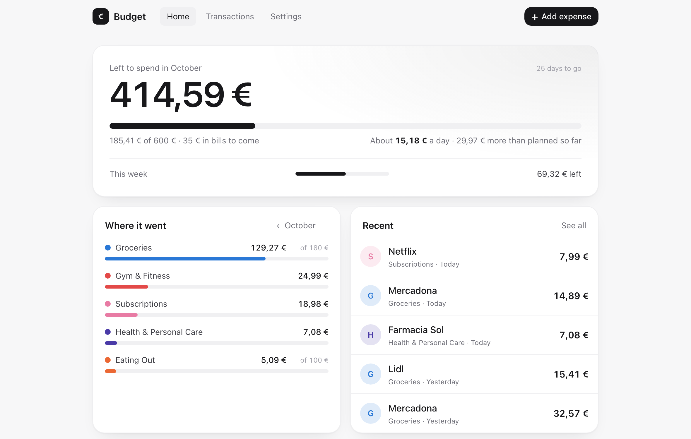
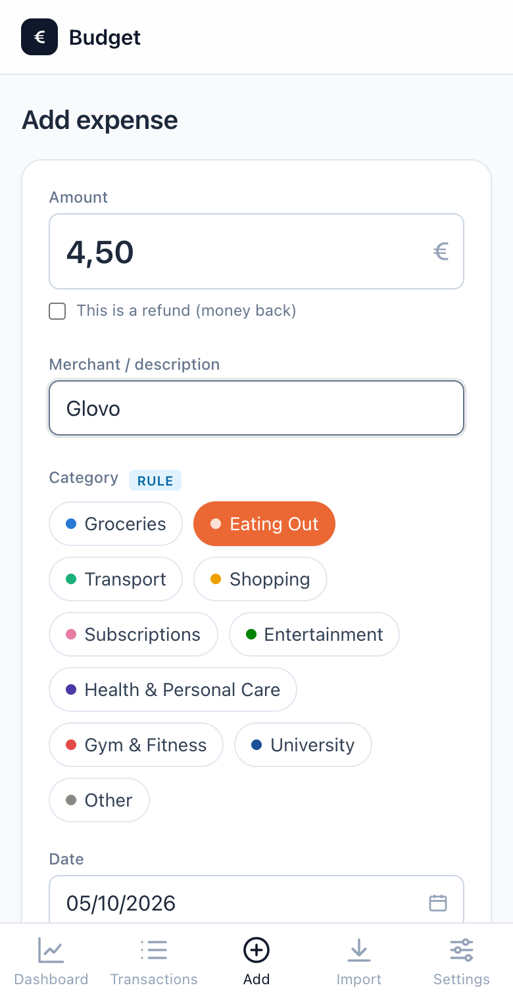

# Budget

A personal budget tracker for your Mac. It's a real app with its own window and a Dock icon, and you open it from Spotlight or Launchpad. Log card spending by hand, from a bank CSV, or automatically from Apple Pay on your iPhone. Budget sorts every expense into a category and shows how you're doing against weekly and monthly limits.

Your data stays on your Mac. There's no account, no cloud and no tracking.

<p align="center">
  
  &nbsp;
  
</p>

**What it does**

- **On your phone too.** Use the whole app in Safari on your home Wi-Fi, protected by a password.
- **Quick entry.** Type the amount and merchant, and the category is suggested as you type. It learns from every correction, and recognises common Spanish merchants (Mercadona, Glovo, Metro, Renfe, Zara…) out of the box.
- **Budgets.** Weekly and monthly limits overall and per category, with green/amber/red progress bars, "€X left this week" and "€Y per day".
- **One clear number.** Home shows what's left to spend this month, how much a day that is, and whether you're ahead of or behind plan. Category bars and recent expenses sit underneath, and charts are one tap away.
- **Monthly bills.** Mark Spotify, the gym or rent as monthly once, and they're added by themselves every month.
- **Looks after itself.** A backup every day, a short look back at last month, and a heads-up if your iPhone Shortcut goes quiet.
- **Themes.** Light, Dark, Sand, Ocean, Lavender, Rose and Noir, or Automatic to follow your Mac or iPhone.
- **Imports.** Bank statement CSVs, with column mapping and duplicate detection, and Apple Pay payments emailed by an iPhone Shortcut and read from Gmail.
- **Optional AI.** With a Claude API key, merchants it doesn't recognise get a suggested category.
- Euros, weeks start on Monday, dates as DD/MM/YYYY.

---

## 1. Install

**You need:**
- A Mac with macOS 12 or newer.
- Python 3.10 or newer. Check with `python3 --version`. If it's missing, get it from [python.org](https://www.python.org/downloads/macos/).
- Git, which macOS offers to install the first time you type `git`.

```bash
git clone https://github.com/wavymaso/budget-app.git
cd budget-app
./build.sh --install
```

This sets up a Python environment, installs the dependencies, runs the tests, builds **Budget.app** and copies it to **/Applications**. The first run takes a few minutes. Then open **Budget** from Spotlight (`Cmd+Space`, type "Budget"), Launchpad, or the Applications folder. To keep it in the Dock, right-click its icon and choose **Options → Keep in Dock**.

Prefer to install it yourself? Run `./build.sh` and drag `dist/Budget.app` into Applications.

When you open Budget, it starts a small private server on your Mac (on `127.0.0.1`, not reachable from the network) and shows the window. Phones can only reach it if you turn on phone access (section 8). Closing the window or pressing `Cmd+Q` shuts everything down. The interface is bundled inside the app, so it works offline.

> **Why build it yourself instead of downloading an app?** The app isn't signed with an Apple developer certificate, so macOS would block a downloaded copy. Building it on your own Mac avoids that, and it also builds for your Mac's processor (Apple Silicon or Intel).

## 2. Where your data lives

```
~/Library/Application Support/Budget/
  budget.db       your expenses, categories, limits and learned merchants
  backups/        copies made with "Back up now"
  .env            optional settings (sections 6 and 8)
```

The data lives outside the app, so **updating, rebuilding or deleting Budget.app never touches your data**. **Settings → Your data → Show in Finder** opens this folder.

The app writes a log to `~/Library/Logs/Budget/budget.log`. Look there if it won't start.

(Very early versions kept the database in the project's `data/` folder. If one is there, Budget copies it over the first time it starts and leaves the original alone.)

## Updating

```bash
cd budget-app
git pull
./build.sh --install
```

If Budget is open, the script quits it, replaces the app in /Applications, and you open it again. The script stops if any test fails, so a broken version never gets installed. The version shown in Finder's **Get Info** comes from the `VERSION` file.

### Changing the code

```bash
python3 run.py            # opens the app window straight from the code (no build needed)
python3 run.py --debug    # same, with the web inspector (right-click > Inspect Element)
python3 run.py --browser  # no window: serve at http://localhost:8000 for a normal browser
.venv/bin/python -m pytest   # run the tests
```

`run.py` uses the same data folder as the installed app, so don't run both at the same time. When you're happy with a change, `./build.sh --install` puts it in the real app. To change the icon, edit `macos/make_icon.py`, run `.venv/bin/python macos/make_icon.py`, and rebuild.

## 3. Using it

| Page | What it's for |
|---|---|
| **Home** | What's left to spend this month, about how much a day that is, and whether you're spending more or less than planned so far. This week is one line underneath. **Where it went** shows a bar per category (against its limit if it has one), and ‹ goes back to earlier months. **Recent** lists your last five expenses. **Show trends** opens month-by-month and day-by-day charts and the places you spend most. Tap anything to see the matching transactions. |
| **+** | Add an expense: amount, where, category and date. Your most frequent merchants are one tap away, and the categories you use most come first. A note and the refund tick are under **More options**. On the Mac, press **N** from anywhere. |
| **Transactions** | Everything you've spent, grouped by day with a total for each day. Search at the top, and **Filters** for category, dates and order. Tap a row to edit or delete it (deleting can be undone). **Import** brings in a bank CSV (section 5). |
| **Settings** | A short list that opens one section at a time: Appearance, Budget, Categories (with learned merchants), Apple Pay via Gmail, Use on your phone, Your data, and About. |

**Themes:** **Settings → Appearance** has Light, Dark, Sand, Ocean, Lavender, Rose and Noir (black and gold), plus **Automatic**, which follows your Mac or iPhone's light and dark mode. The choice is saved with your data, so it stays the same after a restart and on your phone.

Dates are shown as DD/MM/YYYY, weeks start on Monday, and amounts are in euros. You can type amounts as `12,50` or `12.50`.

### How categories are chosen

As you type a merchant, the app suggests a category and shows a small tag saying where the suggestion came from:

1. **LEARNED.** You chose a category for this merchant before. Your choice always wins.
2. **LEARNED · SIMILAR.** The name is very close to a merchant you've already categorised, such as a typo or a different store number.
3. **RULE.** A built-in keyword for common Spanish merchants (Mercadona, Glovo, Metro, Renfe, Zara, Netflix…).
4. **AI.** Claude's guess. This only happens when an API key is set.
5. If nothing matches, the expense is **Uncategorized**. Pick a category and it's remembered for next time.

Names are cleaned up before matching, so `MERCADONA MADRID 4521`, `Compra en MERCADONA, S.A.` and `Mercadona` all count as the same merchant. You can review or change everything the app has learned in **Settings → Categories → Learned merchants**.

## 4. Budgets

In **Settings → Budget**, set a monthly and/or weekly limit for everything. Limits for single categories are optional, under **Limits per category**. Each box saves as soon as you leave it, and an empty box means no limit.

Progress bars are **green** under 75%, **amber** from 75% to 100%, and **red** when you're over. Home shows what's left, how much you can spend per day until the end of the month (today included), and how you compare with an even pace: with a 600 € budget, by day 10 of a 30-day month you'd "plan" to have spent 200 €.

Refunds count as negative spending, so they give you budget back.

### Monthly bills

When you add something you pay every month (Spotify, the gym, your phone, rent), open **More options** and tick **Repeat every month**. From then on Budget adds it by itself on the same day each month. On the 31st, short months use their last day. If Budget wasn't opened for a while, the missed months are filled in on their own dates.

Bills change two things on Home. The per-day amount already sets aside the bills still to come this month ("35 € in bills to come"). And the "more/less than planned so far" check leaves bills out, because they land on a single day and would otherwise make the start of every month look like overspending.

**Settings → Monthly bills** lists them. Change an amount there when a price goes up (it applies from the next bill), or tap ✕ to stop one. Expenses a bill already added stay.

### Month in review

During the first week of each month, Home starts with a short card about the month before: what you spent against your budget, where most of it went, and how it compares with the month before that. Close it with ✕ and it won't come back until next month.

## 5. Importing a bank CSV

1. Download your card movements as CSV from your bank's website.
2. Go to **Transactions → Import** (or **Settings → Your data → Import a bank statement**) and choose the file.
3. Check which columns are the **date**, **description** and **amount**. The app guesses, and it remembers your choice for the next file with the same columns.
4. Say whether spending appears as negative numbers (most Spanish banks: `-12,50`) or positive ones.
5. Click **Preview import**. Each row is categorised automatically. Change any category you disagree with, and the app will learn it.
6. **Likely duplicates are unticked.** That means rows you've already imported, or an expense you already entered by hand with the same amount and a similar merchant within a day. Tick them if they're really new.
7. Click **Import**.

Rows the app can't read, like an impossible date, are listed and skipped.

## 6. AI categorization (optional)

Create the settings file from the template:

```bash
cp .env.example ~/Library/"Application Support"/Budget/.env   # run this inside the budget-app folder
open -e ~/Library/"Application Support"/Budget/.env
```

Put your key from https://console.anthropic.com on this line:

```
ANTHROPIC_API_KEY=sk-ant-...
```

Then quit and reopen Budget. Merchants that none of the other layers recognise are sent to Claude (model `claude-opus-5-5`) and it picks one of your categories. Only the merchant name is sent, never amounts or dates. Each answer is cached, so the same merchant is never sent twice. If the key is missing, wrong, or you're offline, the app simply marks the expense Uncategorized.

## 7. Apple Pay payments from your iPhone, via Gmail

Your iPhone Shortcut emails each Apple Pay payment to yourself. Budget reads those emails from Gmail and adds them as expenses automatically: when it opens, then every 5 minutes while it's open. The emails look like this:

```
To:      your.address+budget@gmail.com
Subject: BUDGET
Body:    2026-10-04T13:22:05+02:00;MERCADONA;12,45 €;EUR
```

Only that line is read. Anything else in the email, like "Sent from my iPhone", is ignored. Budget opens Gmail **read-only**, so it never marks, moves or deletes an email.

### Step 1: the iPhone Shortcuts

These make your iPhone email every Apple Pay payment to you automatically. On the iPhone, the **Mail** app must be signed in to your Gmail account.

#### On iOS 27: describe it and let Shortcuts build it

iOS 27 builds the automation trigger right into the shortcut, so you can describe the whole thing in one go. Open **Shortcuts**, tap **New Shortcut** and paste this, replacing the card name and email address with your own:

> Every time I pay with Apple Pay using my [card name] card in Wallet, run immediately without asking me or showing a notification. Take the transaction's date, merchant, amount, and currency code and combine them into one line of text separated by semicolons, in this exact order: date;merchant;amount;currency. Format the date as ISO 8601. Then send that line in an email to your.address+budget@gmail.com with the subject BUDGET, without showing the compose screen.

For purchases the trigger misses (online orders, cash, Bizum), make a second one:

> Ask me for an amount as a number, then ask me for the merchant name. Combine the current date formatted as ISO 8601, the merchant, the amount, and EUR into one line separated by semicolons, in this exact order: date;merchant;amount;EUR. Send that line in an email to your.address+budget@gmail.com with the subject BUDGET, without showing the compose screen.

The AI usually gets close but can fumble details, so open each one after it's built and check:

- **Trigger:** it's set to Wallet, your card is selected, and it runs immediately.
- **Text line:** it has semicolons in the right order with nothing extra added.
- **Date:** it's set to ISO 8601. If it shows something like "4 Oct 2026", tap the date variable and change the format.
- **Send Email:** **Show Compose Sheet** is off.

#### On older iOS: build it by hand

1. Open **Shortcuts**, go to **Automation**, tap **+**, choose **Transaction**, pick your card(s), and set it to **Run Immediately**. Then tap **Next → New Blank Automation**.
2. Add **Format Date**: date *Current Date*, format **ISO 8601**, **Include Time** on.
3. Add **Text** containing exactly this, inserting the variables with the variable bar:
   `Formatted Date;Merchant;Amount;EUR`
   *Merchant* and *Amount* come from *Shortcut Input* (the transaction).
4. Add **Send Email**:
   - **To:** `your.address+budget@gmail.com`, your own address with `+budget` added
   - **Subject:** `BUDGET`
   - **Body:** the *Text* from step 3
   - Under the arrow, turn **Show Compose Sheet** off, so it sends without asking.

Pay for something with Apple Pay, and an email like the one above should arrive in Gmail. Payments in a currency other than EUR land in the review list instead of being added.

### Step 2: create a Gmail app password

Budget signs in to Gmail with an *app password*, a separate 16-letter password just for this app, not your normal Google password.

1. Turn on **2-Step Verification** at https://myaccount.google.com/security, if it isn't on already. App passwords require it.
2. Go to https://myaccount.google.com/apppasswords.
3. Type the name `Budget` and click **Create**.
4. Copy the 16-letter password. Google shows it with spaces (`abcd efgh ijkl mnop`); you can paste it with or without them.

You can revoke it on the same page at any time; Budget then simply stops importing.

### Step 3: make a Gmail filter and label

So the emails don't clutter your inbox:

1. In Gmail on the web, click the **search options** icon (the sliders) at the right of the search bar.
2. **To:** `your.address+budget@gmail.com`, **Subject:** `BUDGET`
3. Click **Create filter**, then tick:
   - **Skip the Inbox (Archive it)**
   - **Apply the label:** choose **New label…** and name it `Budget`
   - **Never send it to Spam**
4. Click **Create filter**.

The `+budget` part still arrives in your own inbox; Gmail ignores everything after the `+`. That's what makes the filter easy.

IMAP has to be on. On most accounts it always is; if Gmail's **Settings → See all settings → Forwarding and POP/IMAP** shows an IMAP switch, make sure it's enabled.

### Step 4: connect Budget

1. Open Budget and go to **Settings → Apple Pay via Gmail**.
2. Enter your Gmail address and the app password, and leave the label as `Budget`.
3. Click **Test connection**. It tells you plainly whether it worked, and if not, why:

   | Message | What to do |
   |---|---|
   | *Signed in as … The "Budget" label has N emails…* | All good. |
   | *Gmail rejected the address or app password…* | Check the address; create a new app password (not your normal password). |
   | *Signed in, but there's no Gmail label called "Budget"* | The label name must match exactly, including capital letters. |
   | *IMAP is turned off…* | Turn IMAP on (step 3). |
   | *Couldn't reach imap.gmail.com* | The Mac is offline. |

4. Tick **Check automatically…** and click **Save**.

The app password is stored in the **macOS Keychain** (as "Budget – Gmail app password"), never in a file or in the database. After you rebuild the app, macOS may ask once whether Budget may use it. Click **Always Allow**. **Forget saved password** removes it from the Keychain.

### If the Shortcut stops sending

If no Apple Pay email has arrived for 5 days, Home asks whether your iPhone Shortcut is still on. Shortcuts sometimes stop after an iOS update, a new card, or when Mail signs out. If you simply haven't paid with Apple Pay, tap **Hide for a week**. If Gmail itself can't be checked (a wrong or revoked app password, for example), Home says so and links to the fix.

### What happens to each email

- **Imported.** The expense is added and categorized like any other. A notice says "*N new transactions imported*".
- **Needs review.** The email shows up at the top of the **Import** page, and Home, the Transactions page and the Transactions tab show a notice or badge. This happens when the merchant is blank, the amount is 0 €, the amount is in another currency, there's no transaction line at all, or **it looks like an expense you already have**: the same amount, a similar merchant, within a day, from a bank CSV or typed by hand. Fix the fields and click **Add expense**, or **Dismiss** it.
- **Refused.** The email wasn't sent from your own Gmail address, or Gmail flagged its sender as forged. It's never imported.

Each email is remembered by its Message-ID, so nothing is ever imported twice, even if you click **Check now** repeatedly or Gmail renumbers the label. It works the other way too: when you later import a bank CSV, payments that already came in by email are flagged as duplicates in the preview.

**Your Shortcut must send from the same Gmail account** you entered in Budget. The iPhone's Mail app must use that account as the sender. Otherwise the emails are refused.

## 8. Using Budget on your phone (Wi-Fi)

While Budget is open on your Mac, you can use the whole app on your phone in Safari, on the same Wi-Fi: Home, adding expenses, transactions, everything.

### Turn it on (on the Mac)

1. In Budget, go to **Settings → Use on your phone**.
2. Choose a password for your phone (at least 6 characters).
3. Tick **Let phones on this Wi-Fi open Budget** and click **Save**.
4. The section turns green and shows the address to open, for example:
   ```
   http://My-MacBook.local:8000
   http://192.168.1.23:8000
   ```
   The `.local` address keeps working when your Mac's IP address changes.

Phone access stays on the next time you open Budget. It starts and stops straight away; no restart needed.

If the macOS firewall is on (**System Settings → Network → Firewall**), macOS asks once whether Budget may accept incoming connections. Click **Allow**.

### On your phone

1. Connect to the same Wi-Fi as the Mac, open **Safari** and type the address.
2. Sign in with the password. You stay signed in for 30 days.
3. Optional: tap **Share → Add to Home Screen** to get a Budget icon that opens it like an app.

Budget must be open on your Mac for this to work. The Mac does the work; the phone only shows it.

### How it's protected

- **Phones must sign in.** The Mac's own window never asks. Five wrong passwords lock that device out for 10 minutes.
- **Mac-only settings.** A signed-in phone can do everything except change phone access, the password or the Gmail settings. Those only work on the Mac.
- **Signing out.** **Settings → Use on your phone** lists every signed-in device, with **Sign out all**. Changing the password signs every phone out too. A phone can sign itself out under **Settings → This device**.
- **What's stored.** The password is saved only as a salted hash, never readable. The phone gets a random sign-in cookie, of which only a hash is stored.
- **Not encrypted.** The connection is plain `http` on your local network. That's fine at home, but **switch phone access off on shared Wi-Fi** (university, cafés, hotels), where other people on the network could in principle read the traffic.

For a single run from source, `python3 run.py --lan` turns phone access on at port 8000 without saving the setting. Setting `BUDGET_LAN=1` in `.env` does the same every time Budget opens.

### Quick-add API (optional)

With phone access on, an iPhone Shortcut can also add an expense directly, without email and without signing in, using a secret token. Create one:

```bash
python3 -c "import secrets; print(secrets.token_urlsafe(24))"
```

and put it in `~/Library/Application Support/Budget/.env` (see section 6):

```
QUICKADD_TOKEN=paste-the-token-here
```

Quit and reopen Budget. The quick-add URL is your phone address plus `/api/expenses/quick`, e.g. `http://My-MacBook.local:8000/api/expenses/quick`.

### The API

`POST /api/expenses/quick` with header `Authorization: Bearer <your token>` and a JSON body:

| Field | Required | Example |
|---|---|---|
| `amount` | yes | `4.50` or `"4,50"` |
| `merchant` | yes | `"Starbucks"` |
| `date` | no (default: today) | `"2026-10-04"` or `"04/10/2026"` |
| `note` | no | `"with Ana"` |
| `category` | no (default: auto) | `"Eating Out"` |

The reply is the saved expense plus a `message` such as `"Saved 4,50 € at Starbucks · Eating Out"`.

Test it from the Mac (with phone access on at port 8000):

```bash
curl -X POST http://localhost:8000/api/expenses/quick \
  -H "Authorization: Bearer YOUR_TOKEN" \
  -H "Content-Type: application/json" \
  -d '{"amount": "4,50", "merchant": "Starbucks"}'
```

### Build the Shortcut

In the **Shortcuts** app, tap **+** and add these actions in order:

1. **Ask for Input**: Input type *Number*, prompt "Amount (€)?"
2. **Set Variable**: name it `Amount`.
3. **Ask for Input**: Input type *Text*, prompt "Where?"
4. **Set Variable**: name it `Merchant`.
5. **Get Contents of URL**:
   - URL: `http://<your-mac>:8000/api/expenses/quick`
   - Method: **POST**
   - Headers: `Authorization` = `Bearer YOUR_TOKEN`
   - Request Body: **JSON**, with `amount` = *Amount* and `merchant` = *Merchant*
6. **Get Dictionary Value**: get the value for `message` from *Contents of URL*.
7. **Show Notification**: show *Dictionary Value*.

Add it to your Home Screen, or trigger it from an Apple Pay automation (**Automation → Wallet → When I tap a card**). An automation can pass the merchant and amount in directly, so you don't have to type them.

Your Mac must be awake, with Budget open, for the Shortcut to work.

## 9. Back up and restore your data

- **Automatic backups:** once a day, when Budget opens, it saves `backups/budget-auto-YYYY-MM-DD.db` and keeps the last 14. Backups you make yourself are never deleted.
- **Back up now:** go to **Settings → Your data → Back up now**. This saves a timestamped copy such as `backups/budget-2026-10-04_17-49-49.db` next to the database. It's safe to do while the app is open. For extra safety, copy the whole `~/Library/Application Support/Budget` folder to iCloud Drive or a USB stick now and then.
- **Restore:** quit Budget. In `~/Library/Application Support/Budget`, move `budget.db` aside and delete `budget.db-wal` and `budget.db-shm` if they exist. Copy the backup you want to `budget.db` and open Budget again.
- **Export:** **Settings → Your data → Export all to CSV** opens a Save dialog. The file uses `;` separators and decimal commas, so it opens correctly in Spanish-language Excel and Numbers.

Your data and settings are never inside the project folder, so they can't end up on GitHub. `data/`, `.env`, `build/` and `dist/` are also in `.gitignore`.

## 10. Tests

```bash
.venv/bin/python -m pytest
```

The tests cover merchant clean-up, every categorization layer (including corrections beating rules, and AI caching and failure), budget maths (Monday weeks, month ends and leap years, the 75%/100% colour thresholds, € left and € per day), the Gmail import (parsing the email line, refusing other senders, never importing twice, duplicates against bank CSVs, the review list, read-only IMAP access, and the app password never reaching the database), phone access (signing in, slowing down password guessing, Mac-only settings, hashed passwords and session tokens, starting and stopping the Wi-Fi server), the quick-add API, monthly bills (short months, catching up on missed months, never adding twice), automatic backups (one a day, keeping the last 14), saving the colour theme, moving data from the old `data/` folder, and the native CSV export. They use temporary folders and never touch your real data.

## Project layout

```
build.sh               build Budget.app (./build.sh --install also installs it)
run.py                 run from source: python3 run.py
VERSION                app version shown in Finder
app/
  desktop.py           native window (pywebview) + background server + shutdown
  config.py            paths (Application Support), .env settings
  main.py              web app setup; who may reach what (Mac vs. phones)
  auth.py              phone password, sign-in sessions, guessing protection
  server.py            background servers: the window's and the Wi-Fi one for phones
  db.py                database schema, created automatically; moves old data/
  seed.py              default categories + Spanish merchant keywords
  normalize.py         merchant name clean-up
  categorizer.py       learned → similar → keyword → AI
  budgets.py           week/month maths, limits, € left / per day
  recurring.py         monthly bills: added on their day, catching up on missed months
  backups.py           daily automatic backups (last 14 kept) and "Back up now"
  importer.py          CSV reading, date/amount parsing, duplicate checks
  gmail.py             reading Apple Pay emails over IMAP; Keychain for the app password
  email_sync.py        checks Gmail on launch and every 5 minutes; Needs review
  routers/             the JSON API (expenses, categories, budgets, dashboard, import/export, preferences, recurring)
static/                the interface (HTML + JS, login page; Tailwind and Chart.js in static/vendor)
  theme.js             colour themes: every colour is a CSS variable the theme sets
macos/
  Budget.spec          PyInstaller recipe
  launcher.py          entry point inside the app
  make_icon.py         draws icon.png and Budget.icns
tests/                 pytest tests
```
